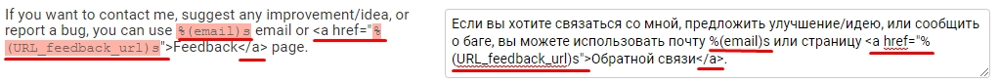

# Contributing

You can contribute to this project by fixing typos, bugs and [translating](CONTRIBUTING.md#Translating).

Currently, there is no need in contributing new functionality.

## How to contribute in general

To contribute to project, you need to follow simple steps:

- Fork repository to your account;
- Create new branch in it, for example, "typo-fixes"
- Make your changes in this branch;
- When you think it's ready, go to pull requests tab of original repository and create a new pull request. Choose main branch of repository and your "typo-fixes" branch.

Don't delete your branch and fork before it's merged (or declined), because if author asks for some change, you will need to make changes in your "typo-fixes" branch in your fork, then it will automatically update in pull request.

## Translating

For easier translating, this project is using [mbi](https://github.com/mbi) / [django-rosetta](https://github.com/mbi/django-rosetta).

To translate, do the following steps:

- Create language files with ```python makemessages -l ru_RU``` where ```ru_RU``` - your language's code (that's actually Russian's language code);
- Create admin account by typing ```python manage.py createsuperuser```;
- Start server by ```python manage.py runserver```;
- Log in admin account on ```localhost:8000/admin/```;
- Go to "ROSETTA" tab on the bottom of admin page, or manually go to ```localhost:8000/rosetta/```;
- Choose your language file. If it does not exist, you are probably used wrong language code on step 1 - try to find correct language code;
- Translate text in rosetta UI. All the red variables and html code needs to be copied and not translated.

That's all! No need in compiling messages. Make sure you are browsed translated website for issues.

P.S. Privacy Policy and Cookie Policy NOT translated, otherwise it would be cruel.

#### Example




